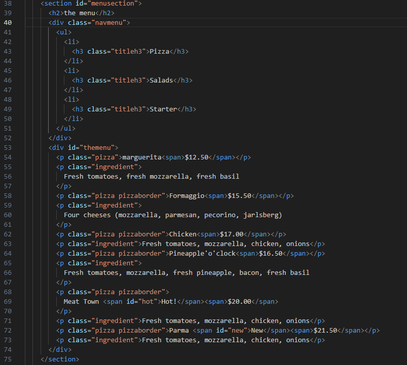

# Mockup Integration for education project

Responsive integration of a pizza restaurant website mockup. For educative purpose 👌 .


## Screenshots




## Code Exemple

```html
<div id="team">
                <!-- (div.card>(img+h3+h4+p+div.contact-btn{Contact}))*4 -->
                <div class="card">
                    
                    <h3>John Doe</h3>
                    <h4>CEO & Founder</h4>
                    <p>Phasellus eget enim eu lectus faucibus vestibulum. Suspendisse sodales pellentesque elementum.
                    </p>
                    <div class="contact-btn">Contact</div>
                </div>
                <div class="card">
                    
                    <h3>Jane Doe</h3>
                    <h4>Architect</h4>
                    <p>Phasellus eget enim eu lectus faucibus vestibulum. Suspendisse sodales pellentesque elementum.
                    </p>
                    <div class="contact-btn">Contact</div>
                </div>
                <div class="card">
                    
                    <h3>Mike Ross</h3>
                    <h4>Architect</h4>
                    <p>Phasellus eget enim eu lectus faucibus vestibulum. Suspendisse sodales pellentesque elementum.
                    </p>
                    <div class="contact-btn">Contact</div>
                </div>
                <div class="card">
                    
                    <h3>Dan Star</h3>
                    <h4>Architect</h4>
                    <p>Phasellus eget enim eu lectus faucibus vestibulum. Suspendisse sodales pellentesque elementum.
                    </p>
                    <div class="contact-btn">Contact</div>
                </div>
            </div>
```
## Languages

- HTML
- CSS
## License

[MIT](https://choosealicense.com/licenses/mit/)


## Contact

[Linkedin](www.linkedin.com/in/olivierriviere)
## Badges

Add badges from somewhere like: [shields.io](https://shields.io/)

[](https://choosealicense.com/licenses/mit/)
[](https://opensource.org/licenses/)
[](http://www.gnu.org/licenses/agpl-3.0)

