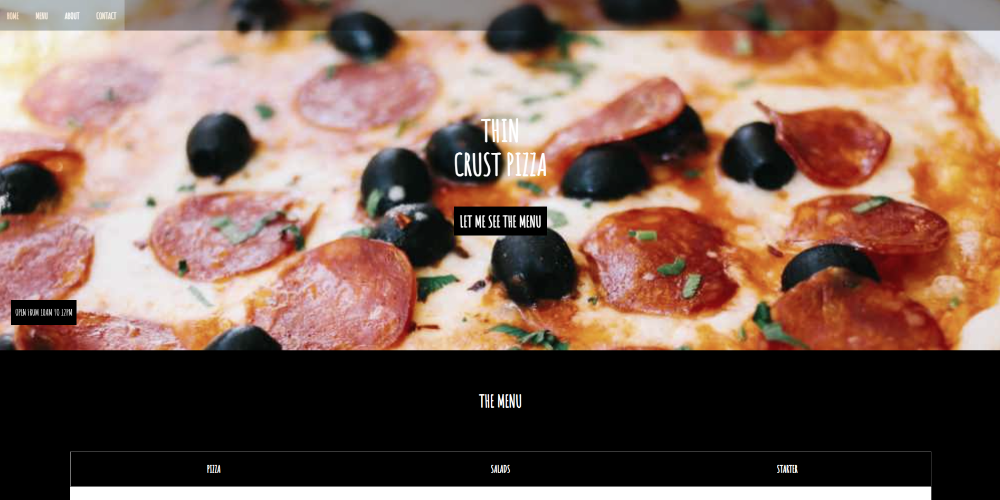

# Mockup Integration for education project

Responsive integration of a pizza restaurant website mockup. For educative purpose 👌 .


## Screenshots




## Code Exemple

```html
<section id="menusection">
      <h2>the menu</h2>
      <div class="navmenu">
        <ul>
          <li>
            <h3 class="titleh3">Pizza</h3>
          </li>
          <li>
            <h3 class="titleh3">Salads</h3>
          </li>
          <li>
            <h3 class="titleh3">Starter</h3>
          </li>
        </ul>
      </div>
      <div id="themenu">
        <p class="pizza">marguerita<span>$12.50</span></p>
        <p class="ingredient">
          Fresh tomatoes, fresh mozzarella, fresh basil
        </p>
        <p class="pizza pizzaborder">Formaggio<span>$15.50</span></p>
        <p class="ingredient">
          Four cheeses (mozzarella, parmesan, pecorino, jarlsberg)
        </p>
        <p class="pizza pizzaborder">Chicken<span>$17.00</span></p>
        <p class="ingredient">Fresh tomatoes, mozzarella, chicken, onions</p>
        <p class="pizza pizzaborder">Pineapple'o'clock<span>$16.50</span></p>
        <p class="ingredient">
          Fresh tomatoes, mozzarella, fresh pineapple, bacon, fresh basil
        </p>
        <p class="pizza pizzaborder">
          Meat Town <span id="hot">Hot!</span><span>$20.00</span>
        </p>
        <p class="ingredient">Fresh tomatoes, mozzarella, chicken, onions</p>
        <p class="pizza pizzaborder">Parma <span id="new">New</span><span>$21.50</span></p>
        <p class="ingredient">Fresh tomatoes, mozzarella, chicken, onions</p>
      </div>
    </section>
```
## Languages

- HTML
- CSS
## License

[MIT](https://choosealicense.com/licenses/mit/)


## Contact

[Linkedin](www.linkedin.com/in/olivierriviere)
## Badges

Add badges from somewhere like: [shields.io](https://shields.io/)

[](https://choosealicense.com/licenses/mit/)
[](https://opensource.org/licenses/)
[](http://www.gnu.org/licenses/agpl-3.0)

